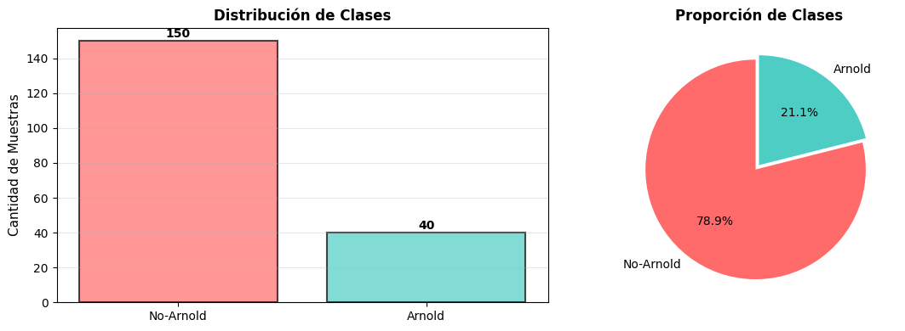
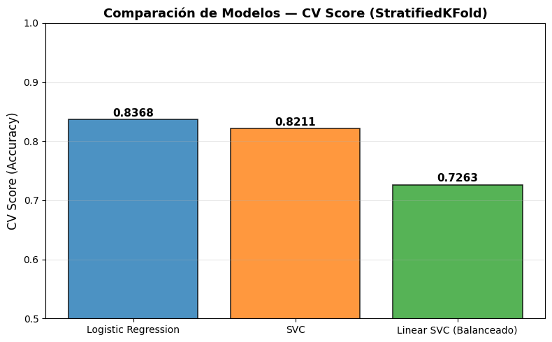

# Facial Recognition — "Arnie vs not-Arnie" detector (LFW)

Binary classifier that decides whether a face is **Arnold Schwarzenegger** or not, using the **LFW (Labeled Faces in the Wild)** dataset. A computer-vision problem solved with **model selection and cross-validation** over pixel features.

Developed as a practical demo for a **technical talk on machine learning and model selection**.


## Dataset

`data/lfw_arnie_nonarnie.csv` — 190 samples, binary classification (Arnie / not-Arnie). The classes are imbalanced (few positive images), so the selection metric is **cross-validated F1 / accuracy with stratified folds**, not plain accuracy.



## Approach

scikit-learn pipeline (`StandardScaler` + classifier) with **GridSearchCV**, comparing three model families:

| Model | CV score (validation) |
|-------|-----------------------|
| `linear_svc` | 0.7263 |
| `logistic_regression` | 0.8211 |
| **`svc`** (RBF) | **0.8368** ← best |



The **production model** is retrained on the **full dataset** (190 samples) using the best hyperparameters found by GridSearchCV.

## Results

- **Best model:** SVC, **CV accuracy ≈ 0.84** (honest generalization estimate).
- Accuracy 1.000 on the held-out test set — but it is a tiny set; with so few samples the **CV ≈ 0.84** is the representative figure.

## How to run

```bash
pip install scikit-learn pandas numpy matplotlib jupyter
jupyter notebook fr_notebook.ipynb
```

## Structure

```
├── fr_notebook.ipynb              # EDA, model selection (GridSearchCV), evaluation
├── data/lfw_arnie_nonarnie.csv    # LFW dataset (Arnie vs not-Arnie)
└── assets/                        # Exported figures
```

## Stack

Python · scikit-learn (SVC, LogisticRegression, LinearSVC, GridSearchCV, Pipeline) · pandas · NumPy · Matplotlib
